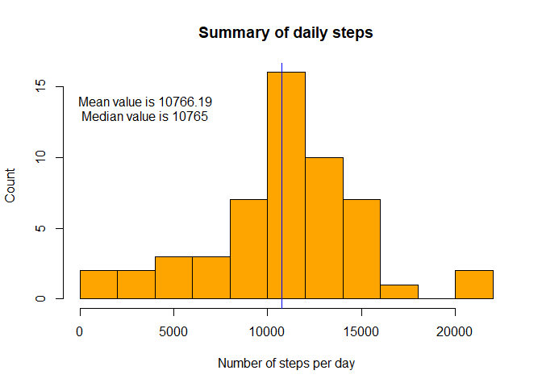
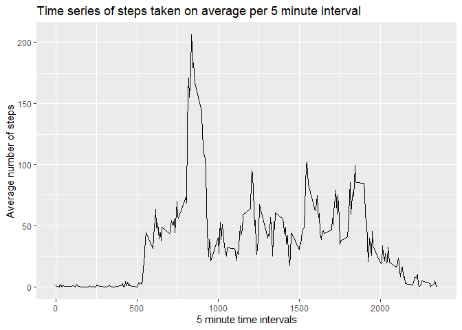
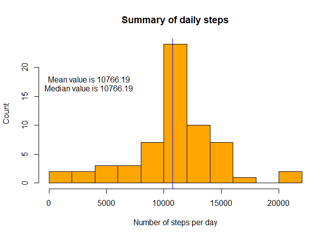
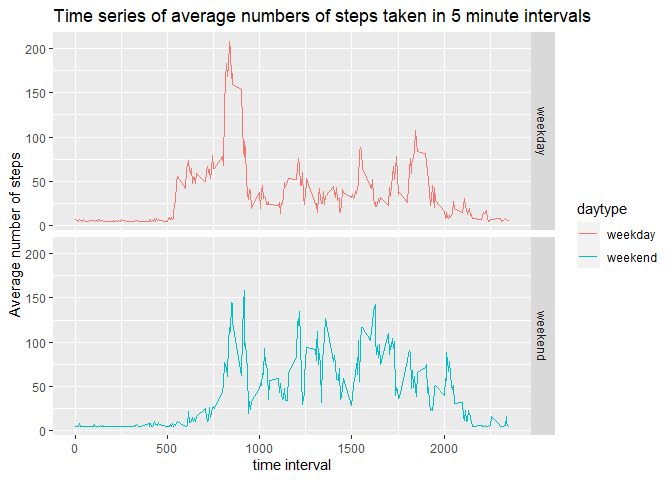

## Loading and preprocessing the data

```r
library(dplyr)
library(ggplot2)
library(knitr)


data <- read.csv("activity.csv")
stepssum <- sum(data$steps)

### Convert date to Date-format
data$date <- as.Date(data$date)
```

## What is mean total number of steps taken per day?


```r
grouped <- group_by(data, date)
groupsum <- summarize(grouped, sumstep = sum(steps), na.rm=TRUE)

hist(groupsum$sumstep, breaks=10, main= "Summary of daily steps", ylab="Count", xlab= "Number of steps per day", col= "orange")
meanSteps <- round(mean(groupsum$sumstep, na.rm=TRUE),2)
abline(v=meanSteps,col="black")
text(3500, 14, paste("Mean value is", meanSteps))
medianSteps <- median(groupsum$sumstep, na.rm=TRUE)
abline(v= medianSteps, col = "blue")
text(3500, 13, paste("Median value is", medianSteps))
```

<!-- -->

```r
# Mean of total number of steps
meanSteps
```

```
## [1] 10766.19
```

```r
# Median of total number of steps
medianSteps
```

```
## [1] 10765
```

The mean number of steps per day is 10766. 


## What is the average daily activity pattern?

```r
# Data aggregated into 5 minute intervals with average number of steps
StepIntervals <- aggregate(steps~interval, mean, data=data)
qplot(interval, steps, data = StepIntervals,geom = "line", main = "Time series of steps taken on average per 5 minute interval", xlab = "5 minute time intervals", ylab = "Average number of steps")
```

<!-- -->

```r
# Check the maximum value
max <- max(StepIntervals$steps)

# Check the interval number where the max value is situated
StepIntervals$interval[StepIntervals$steps==max]
```

```
## [1] 835
```

There is a high peak in the data on 835th 5 minute time interval. 

## Imputing missing values

```r
# Count the number of NA's
sum(is.na(data$steps))
```

```
## [1] 2304
```

```r
# Calculate mean value
meanSteps <- mean(data$steps, na.rm=TRUE)

# Fill NA values with average value
dataNoNAs <- data
dataNoNAs$steps[is.na(dataNoNAs$steps)] <- meanSteps


# Histogram of daily steps with new data where no NA values
grouped <- group_by(dataNoNAs, date)
groupsum <- summarize(grouped, sumstep = sum(steps), na.rm=TRUE)

hist(groupsum$sumstep, breaks=10, main= "Summary of daily steps", ylab="Count", xlab= "Number of steps per day", col= "orange")
meanSteps <- round(mean(groupsum$sumstep, na.rm=TRUE),2)
abline(v=meanSteps,col="black")
text(3500, 18, paste("Mean value is", meanSteps))
medianSteps <- round(median(groupsum$sumstep, na.rm=TRUE), 2)
abline(v= medianSteps, col = "blue")
text(3500, 16.5, paste("Median value is", medianSteps))
```

<!-- -->

```r
# meanSteps
meanSteps
```

```
## [1] 10766.19
```

```r
# medianSteps
medianSteps
```

```
## [1] 10766.19
```

Now median and mean values are the same. Before there was a difference. The number of missing values have an effect to the results. In this case, there were 2304 cases with missing values before they were removed. 


## Are there differences in activity patterns between weekdays and weekends?


```r
# Define weekdays as weekend and weekdays and convert them to factor format 
dataNoNAs$daytype<-as.factor(weekdays(dataNoNAs$date) %in% c("lauantai","sunnuntai"))
levels(dataNoNAs$daytype)<-c("weekday","weekend")

# Aggregate data by daytype and calculate the mean
AggData <- aggregate(steps~interval + daytype, data =dataNoNAs, mean)

# Plotting
ggplot(AggData, aes(interval, steps))+geom_line(aes(color=daytype)) + facet_grid(daytype~.,) + ggtitle("Time series of average numbers of steps taken in 5 minute intervals") + xlab("time interval") + ylab("Average number of steps")
```

<!-- -->


Differences between activity patterns were found between weekdays and weekends. The activity starts later in the weekends and then there is not as high peak as in weekdays. 


